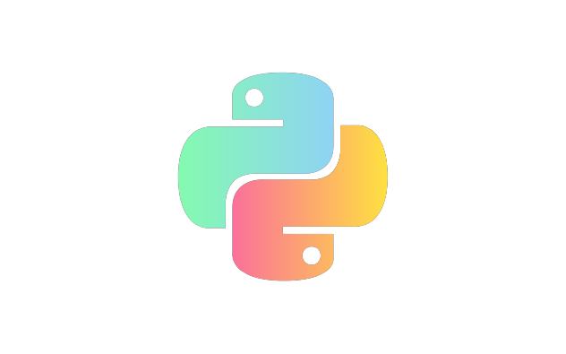

<!-- _class: lead -->



# Introduction to Python

## UCSAS 2022

### Charitarth Chugh

---

# About Me


- Second Year Computer Science Student at UConn
- Secretary of UConn AI Club

## Interests

- Deep Learning
- Linux
- Software Development

<!-- ## Aspirations:

Build really cool stuff related to deep learning! -->

---

# Why Python?

- Python is a language with very diverse applications, from software development to research
- The ecosystem of libraries and tools is awesome, which makes finding niche packages a breeze.
  - If you are not able to find anything that suits your needs, it is fairly easy to create a python package of your own as well.

---

# Prerequisites:

A device with Internet access

<!-- ### Getting set up:

In the terminal, run
`pip install -U numpy pandas matplotib seaborn` -->

---

<!-- _class: [blue,tinytext] -->

# What we will be covering today!

- Python Syntax (Variables, Indentation, Comments)
- Data Types and Methods
  - Strings (`str`)
  - Numerical types (`int`, `float`, `complex`)
  - Mapping (`dict`)
  - Sets (`sets`, `frozenset`)
- Conditions, Loops and Functions
- Basic modules and their respective functions
  - `numpy`: Arrays, Universal Functions (Vectorized), Random numbers (Simulations)
  - `pandas`: DataFrames, Data Manipulation

---

# Syntax

- To comment a line, prefix it with a `#`
- In Python, a new line indicates a start of a new command

```python
# Print Hello, UCSAS
print("Hello, UCSAS!")

print("Workshop going good?")

```

---

## Numerical and Boolean Data Types

- Integer (`int`)
- Float (`float`)
- complex (`complex`)
  - Ex. `1 +3j` where 3j is the complex component
- Boolean (`bool`)
  - Difference here is true is `True` and false is `False`

---

<!-- _class: [blue,tinytext] -->

# Data Types (continued)

## Strings

- String is an array of bytes representing Unicode characters and thus elements can be accessed.
- Multiline strings need three quotes and keep line breaks intact while printing.
- Operators like + concatenates strings, in searches for membership
- Commonly used methods:

  - `replace("a", "b")`: replaces a with b in string
  - `split()`: splits based on given separator
  - `upper()`, `lower()`, `strip()`, `capitalize()`, `casefold()`,
  - `count('a')`, `endswith()`, `startswith()`, `find()`, `index()`

---

## Sidenote: types of strings

#### F-strings:

```python
f"{1+3j} is made up of a real component and a complex component"
```

- Makes it very easy to insert values and expressions into a string.
- Very useful in print statements to see where your code is not working 🙂

#### R-strings

```python
r"./practice.txt"
```

- Ensures that the contents of the string cannot be changed
- Especially useful when you are working with files

---

# Practice time!

## Q1: Manipulatin Strings,4 minutes

### Try not to look things up

---

# Data Types (continued)

## Lists

```python
["a", 1, True]
```

- Can contain any type of elements & even a function.
- Indexed and Ordered as a sequence.
- Index starts at 0, like most programming languages
- Elements can be accessed in the following ways: `x[0]`, `x[-1]`, `x[0:3]`, `x[:2]`, `x[2:]`
- Elements can be modified using `x[1:2] = ["UCSAS", [1,2,3]]`
- Methods: `len(x): length`, `x.insert(2, "Python")`, `x.append("Python")`, `x.remove([1, 2])`, `x.pop(1)`, `x.sort()`,`y = x.copy()`, `x.extend(y)`

---

# Data Types (continued)

## Tuples

```python
(1, 2, [1, 2], 1, "abc")
```

- Created using `()`
- Very similar to a list, but elements inside cannot be changed or be added (immutability)
  - This means that for any change, a new tuple has to be created
- Accessing items is similar to a list.
- Methods: `len(x)`, `x.count("a")`, `x.index()`

---

# Data Types (continued)

## Sets

- Like a list, but cannot include duplicate elements
- A set is not able to be indexed, so the only way to access the elements is to loop over it

```python
>>> a =  {1, "2"}

```

---

# Data Types (Continued)

## Dictionary

- a `dict` is a mapped data type
  - It consists of a key-value pair, where a key is used to access a value.
- The keys of a dictionary are immutable & duplicate keys will replace the original value, but the values themselves are mutable

```python
>>> ucsas = {"workshop": "Introduction To Python", "year": 2022}
>>> ucsas["workshop"]
"Introduction To Python"
>>> ucsas["year"]
2022
>>> ucsas.keys()
["workshop", "year"]
```

---

# Data Types

- Obviously this is not an exhaustive list
- So if you ever need to inspect the type of something, there is a nice built-in `type()` that finds the type.

---

# Variable Assignment

- Is as simple as writing the name of the variable `=` to some value.
- There is no need to define the type of the variable in Python, as it is determined on its own.

```python
# Integer Assignment
x = 2
# String
z = "UCSAS"
## Boolean
w = True
print(x)
print(z)
print(w)
```

---

# Practice time!

## Q2: Manipulating lists

### Try not to look things up

---

# Operators

Arithmetic Operators:

- add: `+`, subtract: `-`, multiply: `*`, division: `/`, modulus: `%`, exponentiation: `**`, floor division: `//`

Assignment Operators:

- equals: `=`, add and equal: `+=`, subtract and equal: `-=`, multiply and equal: `*=`, divide and equal: `/=`

Comparison Operators:
- value equality: `==`, value not equal: `!=`, value greater than: `>`, value less than: `<`, value greater than equal: `>=`, value less than equal: `<=`
  
Logical Operators: 
- `and`, `or`, `not`
---
# Conditionals (If, elif, else)
- The conditionals should be based on a logical input such as ==, >=, >, <, <=, is, is not, in, not in.
- They can be written in one line if the statement has only one statement.
- An if statement cannot be empty. If it has to be, use pass
- If condition are to result in more than two cases, use elif
  and or can be used for the conditional.
- At the end of the condition to verify, use a : and then if a new line is used, use indentation.
---
# Conditionals (continued) 

```python
## checking three scores and using `and`.
a, b, c = 55, 60, 90

if a > b and a > c:
    print('a is first')
elif a < b and b < c:
        print('c is first')
else: print('b is first')

## checking between two scores in one line
a, b = 55, 70

print('a is first') if a > b else print('b is first')

```
---

# Sidenote: Getting help in Python

For any object, you can call the `dir()` function to see all the methods that it support

```python
>>> dir(list)
['__add__', '__class__', '__class_getitem__', ...]
```

For any function, you can call the `help()` function to read more about what the function does and what its arguments represent

```python
>>> help(sorted)
sorted(iterable, /, *, key=None, reverse=False)
    Return a new list containing all items from the iterable in ascending order.

    A custom key function can be supplied to customize the sort order, and the
    reverse flag can be set to request the result in descending order.
```
